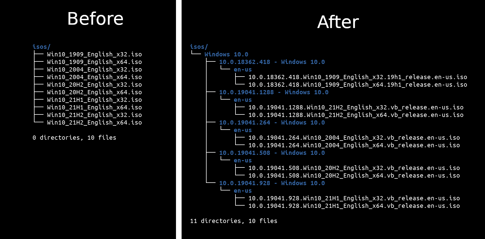

# WindowsBuildFromISO

<p align="center">Extract the windows major and minor build numbers from an ISO file, and automatically sort the iso files.</p>
<p align="center">
  
  <a href="https://twitter.com/intent/follow?screen_name=podalirius_" title="Follow"></a>
  <br>
  <br>
</p>





## Features

 - [x] Parse multiple ISO files from a directory.
 - [x] Detect the Windows build number and OS language.
 - [x] Sort and rename the ISO files in folders by OS major and minor builds.

## Examples

 - **Automatically sort and rename the isos from a directory by major and minor build numbers.**
    ```
    ./WindowsBuildFromISO.py --iso-dir ./isos/ --archive-dir ./archive/
    ```
 
 - **Only get the major and minor build numbers of an ISO.**
    ```
    ./WindowsBuildFromISO.py --iso ./isos/Win10_21H1_x64_English.iso
    ```

## Usage

```
$ ./WindowsBuildFromISO.py -h
usage: WindowsBuildFromISO.py [-h] (-i ISO | -d ISO_DIR) [-a ARCHIVE_DIR] [-v]

Extract Windows Build number from ISO files. v1.1

optional arguments:
  -h, --help            show this help message and exit
  -i ISO, --iso ISO     Path to iso file.
  -d ISO_DIR, --iso-dir ISO_DIR
                        Directory containing multiple ISOs to parse.
  -a ARCHIVE_DIR, --archive-dir ARCHIVE_DIR
                        Archive dir. (default: False)
  -v, --verbose         Verbose mode. (default: False)

```

## How it works

In order to extract the Windows version from an ISO, we first need to mount the ISO file and open its content. In the ISO, there is a `./sources/` folder containing a `Windows imaging (WIM) image` in `./sources/boot.wim`. When we uncompress this archive, we get a lot of files, but one file at the root of the archive stands out: `'[1].xml'`.

```
boot$ ls -lha
total 52K
drwxrwxr-x 5 podalirius podalirius 4,0K janv. 18 00:17  .
drwxrwxr-x 4 podalirius podalirius 4,0K janv. 18 00:17  ..
drwx------ 8 podalirius podalirius 4,0K mars  19  2019  1
-rw-rw-r-- 1 podalirius podalirius 3,9K janv. 18 00:16 '[1].xml'
drwx------ 8 podalirius podalirius 4,0K mars  19  2019  2
drwx------ 2 podalirius podalirius  32K janv. 18 00:16 '[DELETED]'
```

This file is a XML file containing information about the images contained inside the `./sources/boot.wim` file. It contains all the information we need to know which major or minor build this ISO file is. Here is an extract of the [`'[1].xml'`](./example/%5B1%5D.xml) file:

```xml
<WIM>
    <TOTALBYTES>530731284</TOTALBYTES>
    <IMAGE INDEX="1">
        ...
        <WINDOWS>
            <ARCH>9</ARCH>
            <PRODUCTNAME>Microsoft� Windows� Operating System</PRODUCTNAME>
            <EDITIONID>WindowsPE</EDITIONID>
            <INSTALLATIONTYPE>WindowsPE</INSTALLATIONTYPE>
            <PRODUCTTYPE>WinNT</PRODUCTTYPE>
            <PRODUCTSUITE></PRODUCTSUITE>
            <LANGUAGES>
                <LANGUAGE>en-US</LANGUAGE>
                <DEFAULT>en-US</DEFAULT>
            </LANGUAGES>
            <VERSION>
                <MAJOR>10</MAJOR>
                <MINOR>0</MINOR>
                <BUILD>18362</BUILD>
                <SPBUILD>418</SPBUILD>
                <SPLEVEL>0</SPLEVEL>
                <BRANCH>19h1_release</BRANCH>
            </VERSION>
            <SYSTEMROOT>WINDOWS</SYSTEMROOT>
        </WINDOWS>
        <NAME>Microsoft Windows PE (x64)</NAME>
        <DESCRIPTION>Microsoft Windows PE (x64)</DESCRIPTION>
        <FLAGS>9</FLAGS>
    </IMAGE>
    ...
</WIM>
```

## Contributing

Pull requests are welcome. Feel free to open an issue if you want to add other features.

